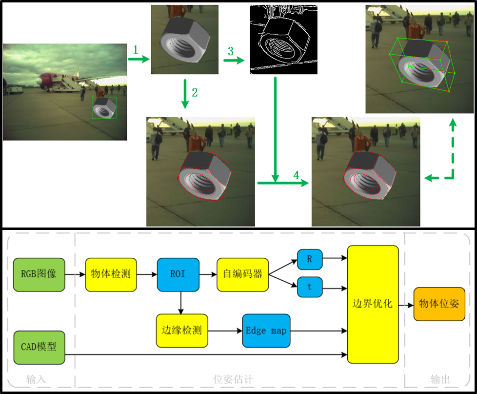
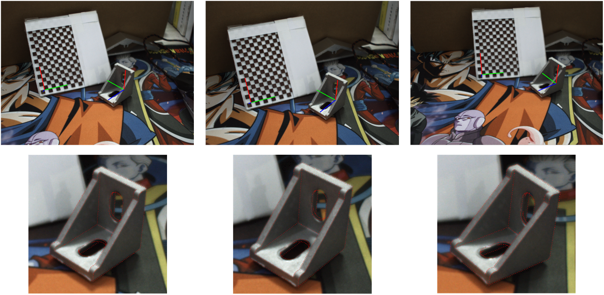
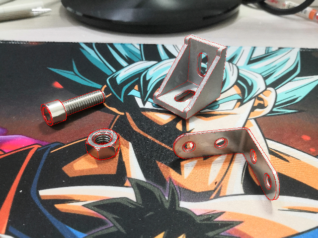
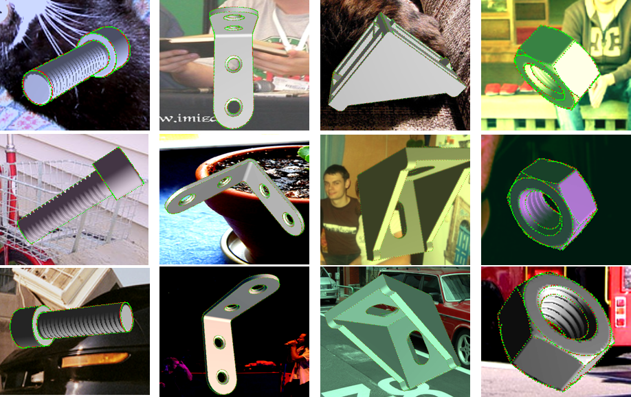
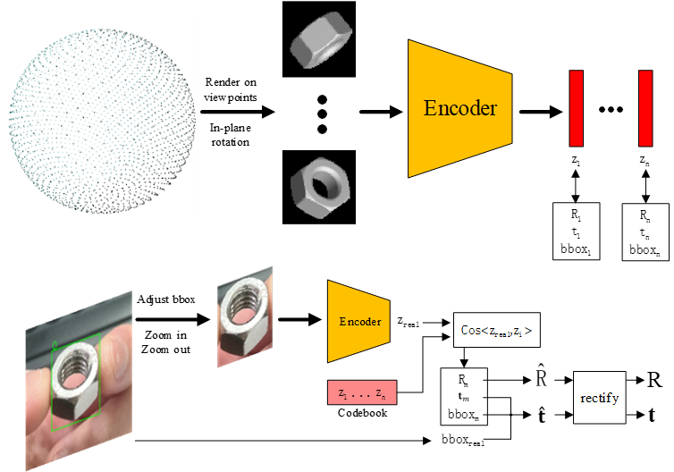
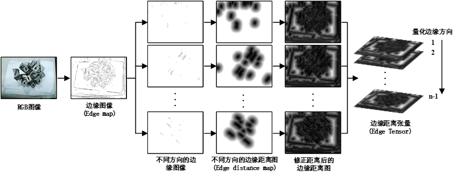

## EPRT ：Edge-based 6D Object Pose Refinement and Tracking

EPRT (Edge-based 6D Object Pose Refinement and Tracking) is an open-source project designed to refine and track the 6D pose of objects in real-time on the edge. It consists of three main stages: object detection, initial pose estimation, and pose refinement based on edge computing. The goal of EPRT is to provide an accurate and efficient method for 6D object pose tracking and optimization.

|  |  |
|--------|--------|
|  | |

|  | |
|--------|--------|
|  |  |

## Project Overview

EPRT involves the following three stages:

1. **Object Detection**: This phase detects the object of interest from the input image and extracts the corresponding patch. YOLO (You Only Look Once) is used for fast and accurate object detection.

2. **Initial Pose Estimation**: 

|  | |
|--------|--------|

The second stage involves estimating the initial 6D pose of the object by using an AAE. This method estimates the relative pose between the object and the camera from the detected object patch.

3. **Edge-based Pose Refinement**: 

|  | |
|--------|--------|

The final stage uses the D2CO method for pose optimization. This technique performs non-linear optimization to minimize the reprojection error, refining the object’s 6D pose on edge devices.

## Environment Setup

Follow these steps to set up the environment:

#### 1. Clone the repository

```bash
git clone https://github.com/yang-yang-o-o/EPRT.git
cd EPRT
```

#### 2.Create a Python 3.6 and cuda-10.1 environment

#### 3.Install dependencies

```bash
pip install -r requirements.txt
```

## Usage

#### 1. Download relative data & weight

```bash
find . -type f -name "download.txt"
```

#### 2. Run EPRT - Edge-based 6D Object Pose Refinement and Tracking

```bash
python inference.py --input_image path_to_image --obj_mesh path_to_object_mesh
```

## Acknowledgements

This project is based on the following open-source code and research:

- YOLO - Official YOLO implementation for object detection
- [AAE](https://arxiv.org/abs/1902.01275) - Used for initial pose estimation
- [D2CO](http://www.diag.uniroma1.it/labrococo/D2CO/miap_icvs2015.pdf) - Method for pose optimization based on non-linear optimization

Thanks to all contributors and the open-source community for their support.

## License

MIT License. See [LICENSE](/LICENSE) for more details.
